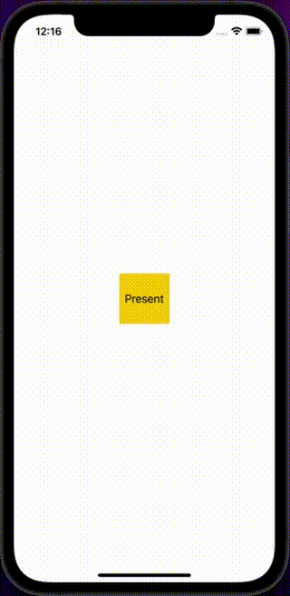

# WWFloatingView

[](https://developer.apple.com/swift/) [](https://developer.apple.com/swift/)  [](https://developer.apple.com/swift/) [](https://developer.apple.com/swift/)

A simple hover and drag window.

一個簡單的懸浮拖曳視窗.



### [Installation with Swift Package Manager](https://medium.com/彼得潘的-swift-ios-app-開發問題解答集/使用-spm-安裝第三方套件-xcode-11-新功能-2c4ffcf85b4b)

```bash
dependencies: [
    .package(url: "https://github.com/William-Weng/WWFloatingView.git", .upToNextMajor(from: "1.0.0"))
]
```

### Example
```swift
import UIKit
import WWPrint
import WWFloatingViewController

final class ViewController: UIViewController {
    
    private lazy var floatingViewController = WWFloatingView.shared.maker()
    private lazy var currentView = UIImageView(image: UIImage(systemName: "scribble.variable"))

    override func viewDidLoad() {
        super.viewDidLoad()
    }
    
    @IBAction func test(_ sender: UIButton) {
        
        let tap = UITapGestureRecognizer(target: self, action: #selector(Self.dismissFloatingViewController(_:)))
        
        currentView.contentMode = .scaleAspectFit
        currentView.backgroundColor = .systemPink.withAlphaComponent(0.5)
        currentView.isUserInteractionEnabled = true
        currentView.addGestureRecognizer(tap)

        floatingViewController.myDelegate = self
        floatingViewController.configure(backgroundColor: .systemTeal.withAlphaComponent(0.5), multiplier: 0.8, completePercent: 0.5, currentView: currentView)
        
        present(floatingViewController, animated: true)
    }
    
    @objc func dismissFloatingViewController(_ recognizer: UITapGestureRecognizer) {
        floatingViewController.dismissViewController()
    }
}

// MARK: - WWFloatingViewDelegate
extension ViewController: WWFloatingViewDelegate {
    
    func willAppear(_ viewController: WWFloatingViewController, completePercent: CGFloat) {
        wwPrint("completePercent => \(completePercent)")
    }
    
    func appearing(_ viewController: WWFloatingViewController, fractionComplete: CGFloat) {
        wwPrint("fractionComplete => \(fractionComplete)")
    }
    
    func didAppear(_ viewController: WWFloatingViewController, animatingPosition: UIViewAnimatingPosition) {
        wwPrint("animatingPosition => \(animatingPosition)")
    }
    
    func willDisAppear(_ viewController: WWFloatingViewController) {
        wwPrint("willDisAppear")
    }

    func didDisAppear(_ viewController: WWFloatingViewController, animatingPosition: UIViewAnimatingPosition) {
        wwPrint("animatingPosition => \(animatingPosition)")
    }
}
```
